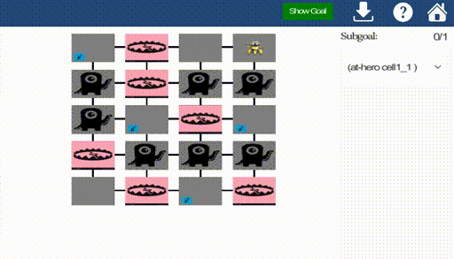
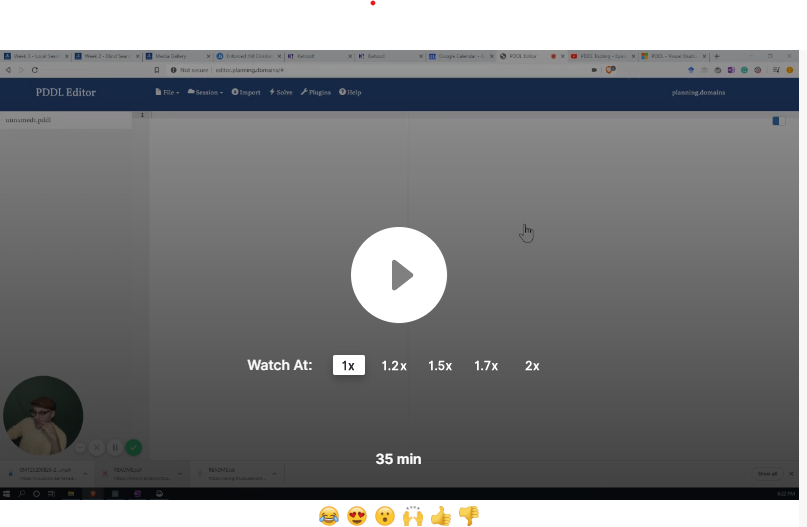

# COMP90054 AI Planning for Autonomy - Project 2 - PDDL modelling 

You must read fully and carefully the assignment specification and instructions detailed in this file. You are NOT to modify this file in any way.

* **Course:** [COMP90054 AI Planning for Autonomy](https://handbook.unimelb.edu.au/subjects/comp90054) @ Semester 2, 2020
* **Instructor:** Dr. Nir Lipovetzky and Prof. Adrian Pearce
* **Deadline:** Sunday 13th September, 2020 @ 11:59pm (end of Week 6)
* **Course Weight:** 5%
* **Assignment type:**: Individual
* **ILOs covered:** 1, 2, and 3
* **Submission method:** via git tagging (see Submission Instructions below for instructions)

The **aim of this project** is to improve your understanding of PDDL modelling.

## Task

**Your task** is to read the description of the the domain below and encode the three planning problem instances specified filling the template files provided in this repository in the folder [pddl_template](pddl_template). 

## The Domain - Real Player Game Scenario

 *Help the hero to get out of dungeon!*
 
 A hero woke up in a dungeon full of monsters and traps (perhaps the party last night went wrong...) and needs your help to get out.  Here are basic facts for the dungeon domain:
- The dungeon contains rooms that are **connected** by corridors (dungeon can thus be represented by undirected graph)
- each room can be **empty**, or can have a **monster** in it, or can have a **trap** in it, or can have a **sword** in it
- one of the empty rooms is the **goal**: it has an exit, so the hero can escape

The hero is lucky since she/he has full knowledge about the dungeon. But not that lucky – just after the hero leaves each room s/he visits, the room is **destroyed** and cannot be visited again.

The hero can perform the following actions – but only if s/he is alive!
- The hero can **move** to an adjacent room (connected by a corridor) that has not been destroyed (i.e., the hero has not already visited the room)
- **Pickup** the sword if present in the room the hero is currently in and the hero is empty handed
- **Destroy** the sword that the hero currently holds. However, this can have unpleasant effects if done in a room with a trap or a monster: it triggers the trap or invites the monster to eat the hero.
- **Disarm a trap** – if there is a trap in the room the hero is in and the hero is empty-handed (does not hold a sword), then the hero can disarm it

However, there are some (dangerous) constraints the hero has to consider:
- If the hero enters a room with a monster in it, s/he has to carry a sword (so the monster is afraid of him/her), otherwise the monster kills him/her. Notice that the hero is pacifist, so s/he cannot kill the monster.
- If the hero destroys the sword in a room with a monster in it, the monster kills him/her as well.
- The only action the hero can safely perform in a room with a trap in it is the **disarm a trap** action. Any other action (even moving away) triggers the trap which kills the hero.

**Important:** We recommend reading the description carefully several times to make sure you fully understand it before starting coding in PDDL.

### Problem 1

The problems are specified such that cells stand for rooms and edges between them represent corridors. **I** is the hero's initial position, **G** is hero's desired goal position, **$S_i$** indicates a sword, **M** is a monster, and **T** stands for trap. Good luck!

### Problem 2

### Problem 3

# Planimated Example Solution

## Marking Criteria

This assignment has a weight of 5% over the final grade. The criteria for marking will be:

- 3 points for encoding the domain correctly. Each correct action counts 0.5 points. If a precondition or effect is missing from an action, the action will earn 0 points.
- 1 point for encoding the 3 problems correctly
- 1 point for generating correct solutions as per the specification of the problem

Your marking will be based on the domain and problem files that you need to complete in the folder [pddl_template](pddl_template). 

**Important:** Make sure to tag your commit with your updated pddl files inside that folder.

## How to get started

Once you clone the files from this repository onto your local machine, watch the following videos on how to get started. Open the [pddl_template](pddl_template) folder and start modeling.

### Upload to Editor.planning.domains, how to save a session and work online

### Download session offline with vscode and call the online planner

### Work with VScode directly and the online planner

### PDDL Tutorials

Live modeling session in PDDL:

VScode PDDL Tutorial: 

### Acknowledgements

This problem was originally proposed at _The Fifth International Competition on Knowledge Engineering for Planning and Scheduling_ [ICKEPS 2016](https://ickeps2016.wordpress.com/scenarios/). Author: [Lukas Chrpa](http://ktiml.mff.cuni.cz/~chrpa/), Charles University in Prague. 

If you want to practice modeling other domains, take a look at the [other problems](https://helios.hud.ac.uk/scommv/ICKEPS/Scenarios.pdf) presented in the competition. All but the first one can be modeled using STRIPS and actions costs.
